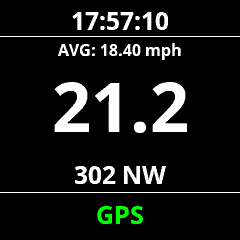

## Description

As its name suggests, this app is just a speedometer, made for Garmin fitness watches.
Launch it like you would any other activity, such as running or cycling.
Supports both miles per hour and kilometers per hour.
Runs on most Garmin watches released since 2018.

Find it on the Garmin connect iq app page!

<form action="https://apps.garmin.com/en-US/apps/209a163c-243d-4dfa-af90-e45dc4f694f0">
    <input type="submit" value="⬇️ Download App" style="
color: #fff;
background-color: #0069d9;
border-color: #0062cc;
text-align: center;
white-space: nowrap;
vertical-align: middle;
border: 1px solid transparent;
  border-top-color: transparent;
  border-right-color: transparent;
  border-bottom-color: transparent;
  border-left-color: transparent;
padding: .375rem .75rem;
font-size: 1rem;
line-height: 1.5;
border-radius: .25rem;"/>
</form>

## Example screenshot

## Why use this app?
Yes you could start a run or cycle activity and see your current ground speed there.
The advantage of this one is that (just) speed is shown front and center.
And it saves a few seconds because it won't ask to save the track file afterwards.